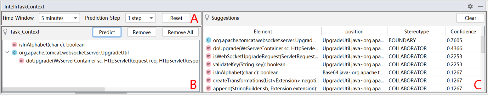

# Document For Plugin

## Overview Introduction

- IntelliTaskContext comprises three views: the **Settings** view (top-left A), the **Task Context** view (bottom-left B), and the **Suggestions** view (top-right C).
  - The <u>Task Context</u> view displays the code elements captured by the tool, forming the initial code context model.
  - The <u>Suggestions</u> view presents a list of code elements recommended by our tool, along with information about their stereotype, position, and predicted confidence level. Developers can click on a suggested element to quickly locate the corresponding Java code in the editor window.
  - Developers can adjust the time interval and prediction step in the <u>Settings</u> view to determine how long the elements remain in the <u>Task Context</u> view and how far our prediction extends beyond the initial model.
  - Additionally, we provide operation buttons (remove, reset, clear, etc.) to simplify the use of our tool.

## Get started

> > Before you begin, ensure that our tool is installed successfully and that IDEA has been reset.
>
> **Step 1:** Set the Time Window and Prediction Step based on your development task.
>
> **Step 2:** Manage the initial code context model in the **Task Context** view.
>
> **Step 3:** Once you've confirmed your initial code context model, click the `Predict` button to receive suggestions from our tool.
>
> **Step 4:** After our tool completes the recommendations, you can view the suggested element list and click on the element you wish to edit or view next. Our tool will automatically navigate the editor window to that element.
>
> > **Tips:** Throughout the completion of your development tasks, feel free to alter the initial context in the **Task Context** view and then obtain suggestions from our tool.

## Cookbook

> How to select Time Window ?

The Time Window determines how long code elements can be retained in the **Task Context** view. When code elements in the initial code context model change, elements that exceed the timeout will be automatically cleared.

Consider the estimated duration of your current task when setting the Time Window. We recommend setting it to a time similar to or slightly less than your task duration. However, it shouldn't be excessively short.

> How to select Prediction Step ?

The Prediction Step determines how far we expand the initial code context model. Choose a step based on the requirements of your task. Generally, a step of 1 may be sufficient.

**Attention:** If your project is very large, selecting a high step may result in performance issues or even cause the tool to freeze.

> How to maintain the initial code context model in <u>Task Context</u> view ?

1. **Adding Elements:**
   - IntelliTaskContext automatically captures code elements accessed by developers, forming the initial code context model. Elements are captured through various actions such as *navigating through the Project and Structure tool window, conducting a full search, and selecting elements in the editor*.
   - Generally, there's no need for additional efforts to add elements to the initial model as our tool handles this automatically.
   - If you wish to manually add elements, you can do so through the aforementioned ways.
2. **Deleting Elements:**
   - You can choose the element you want to delete in the <u>Task Context</u> view and click the `Remove` button.
   - Additionally, you have the option to click the `Remove All` button to clear the <u>Task Context</u> view entirely.

> How to get out tool's suggestions ?

Once you've confirmed your initial code context model, clicking the `Predict` button **once** will generate our suggestions. The processing time may vary based on your project's complexity, the size of the initial model, and the Prediction Step.

Additionally, if the Suggestions table is empty, it indicates that our tool did not provide any suggestions.

Moreover, it's advisable not to trigger multiple predictions if the <u>Task Context</u> remains unchanged, as doing so could lead to performance degradation.

> How to use our suggested elements ?

You can click on an element in the suggestion table that is relevant to your next edit, and our tool will automatically navigate the editor to that Java code element.

> How to handle error occurred in the process of use ?

It's possible that our tool may encounter errors during the project analysis and prediction execution. In such cases, you can try clicking the `Reset`, `Remove All`, and `Clear` buttons to eliminate the working state of our tool. If the error persists and cannot be resolved, you may need to restart IntelliJ IDEA.

> Can I use this tool in multiple project meanwhile ?

No, our tool only supports a single IntelliJ IDEA window. If you have multiple instances of IntelliJ IDEA open, it may lead to errors and unexpected behavior.

