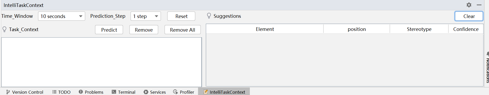

## Requirement

```
Plugin 'IntelliTaskContext' (version "1.0.0') requires build 231.* or older.
```
If our tool is not compatible with the current version of your IDE, consider downgrading to version `2022.3.2`, which has been tested and proven to work seamlessly.

## Installation

1. Download the `IntelliTaskContext-1.0.0.zip` from the GitHub repository.

2. Open IntelliJ IDEA and click on the `File` option in the top bar. Enter the `Settings...` window, and then select `Plugins` to open the plugin installation window.

3. Click the setting icon on the right of `Installed`, and then choose `Install Plugin from Disk...`. Select the zip file downloaded in step one.

4. Restart IntelliJ IDEA.

5. If you can see a new tool window appearing in the bottom toolbar named `IntelliTaskContext`, the installation was successful.

6. Open the `IntelliTaskContext` tool window, as shown in the next figure, and refer to the documentation for using our tool.



